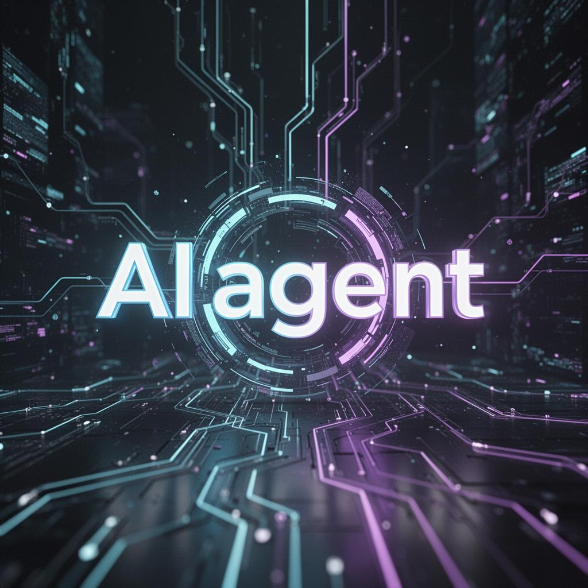

The system prompt leak everyone's been whispering about finally dropped today, and it's exactly as revealing as you'd expect. Meanwhile, OpenAI just raised another $3B from retail investors, pushing their valuation to $852B because apparently we're not in a bubble. Let's dive in.

## AI News

- **System Prompts Leaks: A Deep Dive for Open-Source AI Enthusiasts** — A repository of extracted system prompts from major AI models like ChatGPT, Claude, and Gemini has been released, giving developers insight into how leading LLMs are configured. This is gold for understanding model behavior and fine-tuning your own prompts. [Read more →](https://dev.to/stelixx-insider/system-prompts-leaks-a-deep-dive-for-open-source-ai-enthusiasts-29mn)

- **Ethereum's Vitalik Buterin Warns Against AI Agent Security Risks** — Vitalik flagged security risks associated with AI agents and shared details about his personal LLM setup. When the guy who co-founded Ethereum is worried about AI security, you should probably listen. [Read more →](https://news.google.com/rss/articles/CBMilgFBVV95cUxPRTZFVW82Z19TOWtGS0k0THJjUUVvamhVLUcyOWZ2STlITHZycFd0Vmh3S3hEN2ozU0JkeTFBMVBEYzY0NGpPcDhaWEFFcFhnUmdjbjFKNjlRRmRoSnIyUlBwbWNObnI4Qzc2NUhNZTk5UGFkc3FOdlBLRzlzR3dsdDV2cWpzNDhNR2g1Wk9QNThZbTZZeGc?oc=5)

- **The AI Hype Index: AI Goes to War** — Anthropic and OpenAI engaged in separate Pentagon negotiations while ChatGPT faced user churn and public protests mounted against AI. The military-industrial complex meets AI is happening faster than anyone predicted. [Read more →](https://www.technologyreview.com/2026/03/25/1134571/the-ai-hype-index-ai-goes-to-war/)

- **Types of Learning — Deep Dive + Problem: Image-like Reshaping** — PixelBank published a deep dive on machine learning fundamentals, covering learning types and including a coding problem on image-like reshaping. Solid refresher material if you're rusty on core ML concepts. [Read more →](https://dev.to/pixelbank_dev_a810d06e3e1/types-of-learning-deep-dive-problem-image-like-reshaping-1406)

- **The Real Cost of Running 5 AI Coding Agents in Parallel** — Running five AI coding agents in parallel doesn't multiply costs linearly, though token expenses remain significant. The analysis breaks down per-session token usage from startup context through task completion on typical codebases. [Read more →](https://news.google.com/rss/articles/CBMidgFBVV95cUxPRGNpSGVtSmRjQlJrVjJyZU1oWlFOS2lYVXlZUjVxX0J0aWhaZ0tjVmYyZDJXQjZwY2VfUWpOUVd5dmhXU29zVUVpRlNtYnBvU0JkUmxJYUZ1T3JqQlF2U3VobWJzWlF2bEJrVU1lUmRrVWxzUjJjdGtjZHRmUWNsQmhZUjJkUWdLS0l3UjRkUk1lV3JtVTVaQVN2UjJjdGtjZHRmUWNsQmhZUjJkUWdLS0l3UjRkUk1lV3JtVTVaQVN2UjJjdGtjZHRmUWNsQmhZUjJkUWdLS0l3UjRkUk1lV3JtVTVaQVN2UjJjdGtjZHRmUWNsQmhZUjJkUWdLS0l3UjRkUk1lV3JtVTVaQVN2UjJjdGtjZHRmUWNsQmhZUjJkUWdLS0l3UjRkUk1lV3JtVTVaQVN2UjJjdGtjZHRmUWNsQmhZUjJkUWdLS0l3UjRkUk1lV3JtVTVaQVN2UjJjdGtjZHRmUWNsQmhZUjJkUWdLS0l3UjRkUk1lV3JtVTVaQVN2UjJjdGtjZHRmUWNsQmhZUjJkUWdLS0l3UjRkUk1lV3JtVTVaQVN2UjJjdGtjZHRmUWNsQmhZUjJkUWdLS0l3UjRkUk1lV3JtVTVaQVN2UjJjdGtjZHRmUWNsQmhZUjJkUWdLS0l3UjRkUk1lV3JtVTVaQVN2UjJjdGtjZHRmUWNsQmhZUjJkUWdLS0l3UjRkUk1lV3JtVTVaQVN2UjJjdGtjZHRmUWNsQmhZUjJkUWdLS0l3UjRkUk1lV3JtVTVaQVN2UjJjdGtjZHRmUWNsQmhZUjJkUWdLS0l3UjRkUk1lV3JtVTVaQVN2UjJjdGtjZHRmUWNsQmhZUjJkUWdLS0l3UjRkUk1lV3JtVTVaQVN2UjJjdGtjZHRmUWNsQmhZUjJkUWdLS0l3UjRkUk1lV3JtVTVaQVN2UjJjdGtjZHRmUWNsQmhZUjJkUWdLS0l3UjRkUk1lV3JtVTVaQVN2UjJjdGtjZHRmUWNsQmhZUjJkUWdLS0l3UjRkUk1lV3JtVTVaQVN2UjJjdGtjZHRmUWNsQmhZUjJkUWdLS0l3UjRkUk1lV3JtVTVaQVN2UjJjdGtjZHRmUWNsQmhZUjJkUWdLS0l3UjRkUk1lV3JtVTVaQVN2UjJjdGtjZHRmUWNsQmhZUjJkUWdLS0l3UjRkUk1lV3JtVTVaQVN2UjJjdGtjZHRmUWNsQmhZUjJkUWdLS0l3UjRkUk1lV3JtVTVaQVN2UjJjdGtjZHRmUWNsQmhZUjJkUWdLS0l3UjRkUk1lV3JtVTVaQVN2UjJjdGtjZHRmUWNsQmhZUjJkUWdLS0l3UjRkUk1lV3JtVTVaQVN2UjJjdGtjZHRmUWNsQmhZUjJkUWdLS0l3UjRkUk1lV3JtVTVaQVN2UjJjdGtjZHRmUWNsQmhZUjJkUWdLS0l3UjRkUk1lV3JtVTVaQVN2UjJjdGtjZHRmUWNsQmhZUjJkUWdLS0l3UjRkUk1lV3JtVTVaQVN2UjJjdGtjZHRmUWNsQmhZUjJkUWdLS0l3UjRkUk1lV3JtVTVaQVN2UjJjdGtjZHRmUWNsQmhZUjJkUWdLS0l3UjRkUk1lV3JtVTVaQVN2UjJjdGtjZHRmUWNsQmhZUjJkUWdLS0l3UjRkUk1lV3JtVTVaQVN2UjJjdGtjZHRmUWNsQmhZUjJkUWdLS0l3UjRkUk1lV3JtVTVaQVN2UjJjdGtjZHRmUWNsQmhZUjJkUWdLS0l3UjRkUk1lV3JtVTVaQVN2UjJjdGtjZHRmUWNsQmhZUjJkUWdLS0l3UjRkUk1lV3JtVTVaQVN2UjJjdGtjZHRmUWNsQmhZUjJkUWdLS0l3UjRkUk1lV3JtVTVaQVN2UjJjdGtjZHRmUWNsQmhZUjJkUWdLS0l3UjRkUk1lV3JtVTVaQVN2UjJjdGtjZHRmUWNsQmhZUjJkUWdLS0l3UjRkUk1lV3JtVTVaQVN2UjJjdGtjZHRmUWNsQmhZUjJkUWdLS0l3UjRkUk1lV3JtVTVaQVN2UjJjdGtjZHRmUWNsQmhZUjJkUWdLS0l3UjRkUk1lV3JtVTVaQVN2UjJjdGtjZHRmUWNsQmhZUjJkUWdLS0l3UjRkUk1lV3JtVTVaQVN2UjJjdGtjZHRmUWNsQmhZUjJkUWdLS0l3UjRkUk1lV3JtVTVaQVN2UjJjdGtjZHRmUWNsQmhZUjJkUWdLS0l3UjRkUk1lV3JtVTVaQVN2UjJjdGtjZHRmUWNsQmhZUjJkUWdLS0l3UjRkUk1lV3JtVTVaQVN2UjJjdGtjZHRmUWNsQmhZUjJkUWdLS0l3UjRkUk1lV3JtVTVaQVN2UjJjdGtjZHRmUWNsQmhZUjJkUWdLS0l3UjRkUk1lV3JtVTVaQVN2UjJjdGtjZHRmUWNsQmhZUjJkUWdLS0l3UjRkUk1lV3JtVTVaQVN2UjJjdGtjZHRmUWNsQmhZUjJkUWdLS0l3UjRkUk1lV3JtVTVaQVN2UjJjdGtjZHRmUWNsQmhZUjJkUWdLS0l3UjRkUk1lV3JtVTVaQVN2UjJjdGtjZHRmUWNsQmhZUjJkUWdLS0l3UjRkUk1lV3JtVTVaQVN2UjJjdGtjZHRmUWNsQmhZUjJkUWdLS0l3UjRkUk1lV3JtVTVaQVN2UjJjdGtjZHRmUWNsQmhZUjJkUWdLS0l3UjRkUk1lV3JtVTVaQVN2UjJjdGtjZHRmUWNsQmhZUjJkUWdLS0l3UjRkUk1lV3JtVTVaQVN2UjJjdGtjZHRmUWNsQmhZUjJkUWdLS0l3UjRkUk1lV3JtVTVaQVN2UjJjdGtjZHRmUWNsQmhZUjJkUWdLS0l3UjRkUk1lV3JtVTVaQVN2UjJjdGtjZHRmUWNsQmhZUjJkUWdLS0l3UjRkUk1lV3JtVTVaQVN2UjJjdGtjZHRmUWNsQmhZUjJkUWdLS0l3UjRkUk1lV3JtVTVaQVN2UjJjdGtjZHRmUWNsQmhZUjJkUWdLS0l3UjRkUk1lV3JtVTVaQVN2UjJjdGtjZHRmUWNsQmhZUjJkUWdLS0l3UjRkUk1lV3JtVTVaQVN2UjJjdGtjZHRmUWNsQmhZUjJkUWdLS0l3UjRkUk1lV3JtVTVaQVN2UjJjdGtjZHRmUWNsQmhZUjJkUWdLS0l3UjRkUk1lV3JtVTVaQVN2UjJjdGtjZHRmUWNsQmhZUjJkUWdLS0l3UjRkUk1lV3JtVTVaQVN2UjJjdGtjZHRmUWNsQmhZUjJkUWdLS0l3UjRkUk1lV3JtVTVaQVN2UjJjdGtjZHRmUWNsQmhZUjJkUWdLS0l3UjRkUk1lV3JtVTVaQVN2UjJjdGtjZHRmUWNsQmhZUjJkUWdLS0l3UjRkUk1lV3JtVTVaQVN2UjJjdGtjZHRmUWNsQmhZUjJkUWdLS0l3UjRkUk1lV3JtVTVaQVN2UjJjdGtjZHRmUWNsQmhZUjJkUWdLS0l3UjRkUk1lV3JtVTVaQVN2UjJjdGtjZHRmUWNsQmhZUjJkUWdLS0l3UjRkUk1lV3JtVTVaQVN2UjJjdGtjZHRmUWNsQmhZUjJkUWdLS0l3UjRkUk1lV3JtVTVaQVN2UjJjdGtjZHRmUWNsQmhZUjJkUWdLS0l3UjRkUk1lV3JtVTVaQVN2UjJjdGtjZHRmUWNsQmhZUjJkUWdLS0l3UjRkUk1lV3JtVTVaQVN2UjJjdGtjZHRmUWNsQmhZUjJkUWdLS0l3UjRkUk1lV3JtVTVaQVN2UjJjdGtjZHRmUWNsQmhZUjJkUWdLS0l3UjRkUk1lV3JtVTVaQVN2UjJjdGtjZHRmUWNsQmhZUjJkUWdLS0l3UjRkUk1lV3JtVTVaQVN2UjJjdGtjZHRmUWNsQmhZUjJkUWdLS0l3UjRkUk1lV3JtVTVaQVN2UjJjdGtjZHRmUWNsQmhZUjJkUWdLS0l3UjRkUk1lV3JtVTVaQVN2UjJjdGtjZHRmUWNsQmhZUjJkUWdLS0l3UjRkUk1lV3JtVTVaQVN2UjJjdGtjZHRmUWNsQmhZUjJkUWdLS0l3UjRkUk1lV3JtVTVaQVN2UjJjdGtjZHRmUWNsQmhZUjJkUWdLS0l3UjRkUk1lV3JtVTVaQVN2UjJjdGtjZHRmUWNsQmhZUjJkUWdLS0l3UjRkUk1lV3JtVTVaQVN2UjJjdGtjZHRmUWNsQmhZUjJkUWdLS0l3UjRkUk1lV3JtVTVaQVN2UjJjdGtjZHRmUWNsQmhZUjJkUWdLS0l3UjRkUk1lV3JtVTVaQVN2UjJjdGtjZHRmUWNsQmhZUjJkUWdLS0l3UjRkUk1lV3JtVTVaQVN2UjJjdGtjZHRmUWNsQmhZUjJkUWdLS0l3UjRkUk1lV3JtVTVaQVN2UjJjdGtjZHRmUWNsQmhZUjJkUWdLS0l3UjRkUk1lV3JtVTVaQVN2UjJjdGtjZHRmUWNsQmhZUjJkUWdLS0l3UjRkUk1lV3JtVTVaQVN2UjJjdGtjZHRmUWNsQmhZUjJkUWdLS0l3UjRkUk1lV3JtVTVaQVN2UjJjdGtjZHRmUWNsQmhZUjJkUWdLS0l3UjRkUk1lV3JtVTVaQVN2UjJjdGtjZHRmUWNsQmhZUjJkUWdLS0l3UjRkUk1lV3JtVTVaQVN2UjJjdGtjZHRmUWNsQmhZUjJkUWdLS0l3UjRkUk1lV3JtVTVaQVN2UjJjdGtjZHRmUWNsQmhZUjJkUWdLS0l3UjRkUk1lV3JtVTVaQVN2UjJjdGtjZHRmUWNsQmhZUjJkUWdLS0l3UjRkUk1lV3JtVTVaQVN2UjJjdGtjZHRmUWNsQmhZUjJkUWdLS0l3UjRkUk1lV3JtVTVaQVN2UjJjdGtjZHRmUWNsQmhZUjJkUWdLS0l3UjRkUk1lV3JtVTVaQVN2UjJjdGtjZHRmUWNsQmhZUjJkUWdLS0l3UjRkUk1lV3JtVTVaQVN2UjJjdGtjZHRmUWNsQmhZUjJkUWdLS0l3UjRkUk1lV3JtVTVaQVN2Uj

---

*Generated on 2026-04-04 by [AI Tech Daily Agent](https://github.com/gautammanak1/ai-tech-daily-agent)*
