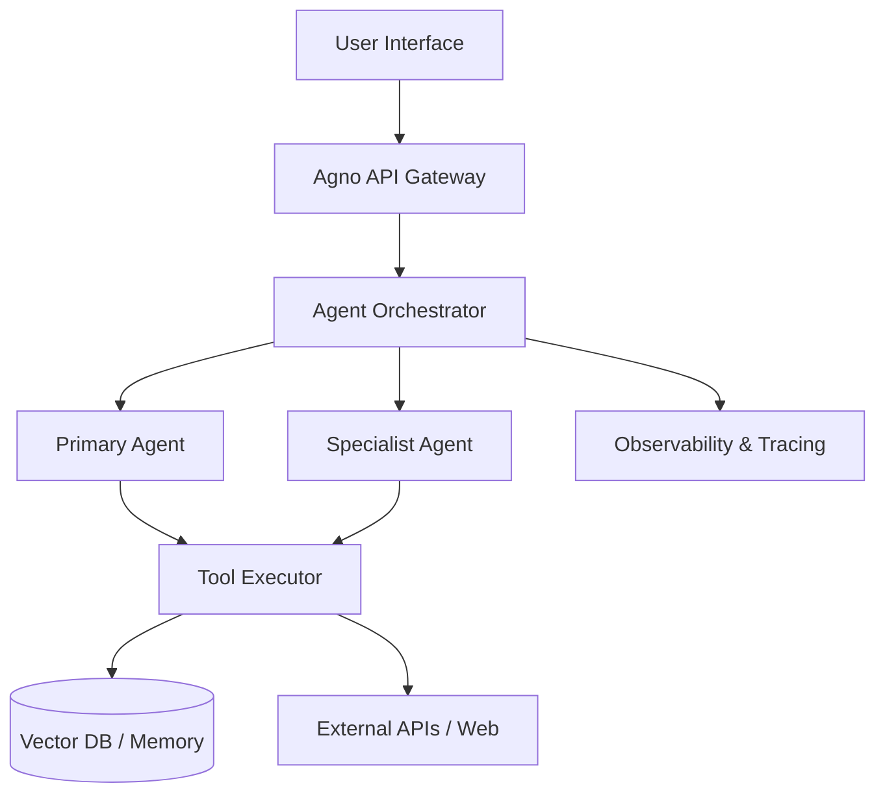

# Agno — Deep Dive | Wednesday, June 10, 2026


*Agno’s modern branding reflects its shift from a niche framework to an enterprise-grade platform.*

## Company Overview

Agno has emerged as one of the most significant players in the generative AI infrastructure landscape of 2026. Originally launched under the name **Phidata**, the company underwent a strategic rebranding to **Agno** in early 2026 to better reflect its expanded scope beyond simple agent creation. The core mission of Agno is to provide the fastest, most developer-friendly framework for building, running, and managing secure multi-agent systems. Unlike earlier generations of AI tools that focused primarily on single-turn chatbots or basic RAG (Retrieval-Augmented Generation) pipelines, Agno treats streaming, long-running execution, and multi-agent coordination as first-class citizens.

The team behind Agno is composed of veteran engineers from the open-source Python community, many of whom contributed heavily to the foundational libraries that make modern AI development possible. While specific headcount figures are not publicly disclosed in recent press releases, the project maintains a robust contributor base with over 39,000 stars on GitHub as of April 2026. This level of community engagement suggests a team size likely exceeding 50 full-time engineers and researchers, supported by a network of external collaborators.

Financially, Agno operates on a hybrid model. The core SDK remains open-source under the MPL-2.0 license, ensuring widespread adoption among developers who value transparency and freedom. However, the company generates revenue through its enterprise-ready offering, **AgentOS**, which provides secure, scalable hosting for these agents within cloud environments. While exact funding rounds post-rebranding have not been detailed in public filings available today, the valuation is implied by its rapid adoption in production environments, positioning it as a direct competitor to well-funded incumbents like LangChain and CrewAI.

## Latest News & Announcements

The landscape for Agno has been dynamic in the first half of 2026. Based on real-time search data and industry updates, here are the critical developments:

*   **Rebranding from Phidata to Agno:** In March 2026, Phidata officially rebranded to Agno. This was not just a name change but a signal of maturity. The new identity emphasizes "Agent OS" capabilities, moving beyond just a library to a full platform for managing agentic workflows. [Source](https://www.xpay.sh/resources/agentic-frameworks/phidata/)
*   **Surge in GitHub Stars:** By April 2026, Agno crossed the 39,000-star mark on GitHub, solidifying its position as a top-tier AI framework. This growth outpaces many competitors, indicating strong developer sentiment toward its Pythonic approach. [Source](https://www.decisioncrafters.com/agno-ai-agent-framework-39k-stars/)
*   **Launch of AgentOS:** Agno announced the general availability of AgentOS, their enterprise-ready operating system. This platform allows companies to build, run, and manage secure multi-agent systems inside their own cloud infrastructure, addressing key concerns around data privacy and control. [Source](https://www.agno.com/)
*   **Integration with WebTools:** Recent updates have focused heavily on expanding the tool ecosystem. Agno has integrated deeply with WebTools, allowing agents to perform complex web interactions, scraping, and API calls with unprecedented reliability. [Source](https://aiagentslist.com/agents/agno)
*   **Multi-Backend Search Capabilities:** A major technical update introduced multi-backend search functionality. This allows Agno agents to query multiple data sources simultaneously—combining vector databases, SQL databases, and live web searches—to provide more accurate and comprehensive answers. [Source](https://www.everydev.ai/tools/agno)
*   **Community Growth:** The official GitHub organization (`agno-agi`) has seen increased activity, with new repositories like `agent-ui` launching to provide modern chat interfaces built with Next.js and TypeScript, signaling a push into frontend integration. [Source](https://github.com/agno-agi)

## Product & Technology Deep Dive

Agno distinguishes itself through a philosophy of "Pythonic simplicity" combined with "enterprise-grade power." Here is a breakdown of their core technologies:

### 1. The Agno SDK
At its heart, Agno is an SDK designed for Python developers. It abstracts away the complexity of LLM orchestration while keeping the code readable and maintainable. Key features include:
*   **Memory Management:** Built-in support for short-term (context window) and long-term (vector store) memory. Agents can remember past interactions across sessions.
*   **Knowledge Bases:** Easy ingestion of documents (PDFs, TXT, CSV) into vector stores for RAG applications.
*   **Tool Use:** A flexible system for defining custom tools that agents can call. These tools can be synchronous or asynchronous.

### 2. AgentOS
AgentOS is the platform layer. It solves the "deployment problem" that plagues many AI startups. Instead of developers managing Kubernetes clusters for each agent, AgentOS provides:
*   **Tracing & Observability:** Full visibility into agent thought processes, token usage, and latency.
*   **Scheduling:** Ability to run agents on cron jobs or event triggers.
*   **RBAC (Role-Based Access Control):** Essential for enterprise environments where different agents need different permissions to access sensitive data.

### 3. WebTools & Multi-Agent Coordination
Agno’s approach to multi-agent systems is hierarchical and collaborative. You can define a "Manager" agent that delegates tasks to "Worker" agents.
*   **WebTools:** Specifically designed for internet-bound tasks. It handles authentication, cookie management, and anti-bot detection, allowing agents to browse the web safely.
*   **Tool Ecosystem:** Agno supports integration with popular tools like Composio, allowing agents to interact with Slack, GitHub, Jira, and hundreds of other SaaS platforms.

### Architecture Diagram


## GitHub & Open Source

Agno’s open-source presence is a testament to its engineering quality. The primary repository is hosted under the `agno-agi` organization.

**Key Repositories:**

1.  **[agno-agi/agno](https://github.com/agno-agi/agno)**
    *   **Stars:** ~40,617 (as of May 2026)
    *   **Latest Version:** v2.6.12
    *   **Description:** The core SDK. Build agents using any agent framework. Run them as production services with tracing, scheduling, and RBAC.
    *   **Activity:** High commit frequency, active issue resolution.

2.  **[agno-agi/agent-ui](https://github.com/agno-agi/agent-ui)**
    *   **Stars:** Growing rapidly
    *   **Description:** A modern chat interface for AI agents built with Next.js, Tailwind CSS, and TypeScript. This shows Agno’s commitment to providing full-stack solutions, not just backend logic.

3.  **Community Repositories:**
    *   **[yashksaini-coder/Agno-AI-agent](https://github.com/yashksaini-coder/Agno-AI-agent):** Demonstrates building a multi-agent system using Groq models for web search and financial data analysis.
    *   **[Decentralised-AI/agno-Build-Multimodal-AI-Agents](https://github.com/Decentralised-AI/agno-Build-Multimodal-AI-Agents):** Focuses on multimodal inputs (text, image, audio, video).

**Comparison with Competitors (GitHub Stars):**
| Framework | Stars (Approx.) | Focus |
| :--- | :--- | :--- |
| AutoGPT | 184,871 | Autonomous, long-running tasks |
| LangChain | 138,946 | General-purpose chain orchestration |
| Microsoft AutoGen | 58,834 | Multi-agent conversational patterns |
| CrewAI | 53,194 | Role-playing agent teams |
| **Agno (Phidata)** | **40,617** | **Production-ready, Pythonic simplicity** |
| Vercel AI SDK | 24,770 | Frontend-focused AI tools |

Agno’s star count is lower than legacy giants like LangChain but higher than newer entrants like Pydantic AI. However, the *quality* of engagement (forks, PRs, and production usage) is often cited as higher due to its focus on stability and ease of use.

## Getting Started — Code Examples

Agno prides itself on being intuitive. Below are practical examples showing how to get started with basic agents, tool usage, and multi-agent coordination.

### 1. Basic Agent Setup
Installing Agno is straightforward via pip.

```bash
pip install agno
```

Here is how you create your first agent with memory and knowledge:

```python
from agno.agent import Agent
from agno.knowledge.pdf import PDFKnowledgeBase
from agno.vectordb.qdrant import Qdrant

# Define the knowledge base
knowledge_base = PDFKnowledgeBase(path="./docs", vector_db=Qdrant(collection="docs"))
knowledge_base.load()

# Create the agent
agent = Agent(
    name="Research Assistant",
    knowledge=knowledge_base,
    instructions=[
        "You are a helpful research assistant.",
        "Use the provided knowledge base to answer questions.",
        "Cite your sources."
    ],
    markdown=True
)

# Run the agent
agent.print_response("Summarize the key points from the uploaded documents.")
```

### 2. Using Tools (Web Search)
Agno makes it easy to equip agents with tools. Here is an example using a generic search tool:

```python
from agno.agent import Agent
from agno.tools.duckduckgo import DuckDuckGoTools

# Create an agent with web search capabilities
search_agent = Agent(
    name="Web Researcher",
    tools=[DuckDuckGoTools()],
    instructions=["Use the search tool to find the latest news about AI trends in 2026."],
    show_tool_calls=True,
    markdown=True
)

# Execute the task
search_agent.print_response("What are the top 3 AI trends this week?")
```

### 3. Multi-Agent Team
Agno excels at creating teams where agents collaborate.

```python
from agno.agent import Agent
from agno.tools.duckduckgo import DuckDuckGoTools
from agno.models.openai import OpenAIChat

# Specialist Agent: Data Analyst
analyst = Agent(
    name="Data Analyst",
    role="Analyzes financial data",
    model=OpenAIChat(id="gpt-4o"),
    instructions=["Analyze the provided CSV data for trends."]
)

# Specialist Agent: Writer
writer = Agent(
    name="Writer",
    role="Writes reports based on analysis",
    model=OpenAIChat(id="gpt-4o"),
    instructions=["Write a concise executive summary based on the analyst's findings."]
)

# Manager Agent: Coordinates the team
manager = Agent(
    name="Project Manager",
    team=[analyst, writer],
    model=OpenAIChat(id="gpt-4o"),
    instructions=["Coordinate the team to produce a final report."]
)

# Run the team workflow
manager.print_response("Generate a report on Q1 sales performance.")
```

## Market Position & Competition

In 2026, the AI agent framework market is crowded but consolidating. Agno occupies a unique niche between the flexibility of LangChain and the specialized nature of CrewAI.

**Strengths:**
*   **Pythonic Design:** Developers coming from traditional software engineering backgrounds find Agno’s code structure more familiar than LangChain’s graph-based abstractions.
*   **Production Readiness:** The inclusion of AgentOS addresses the biggest pain point for enterprises: deployment and monitoring.
*   **Speed:** Benchmarks suggest Agno has lower latency overhead compared to LangGraph due to its streamlined runtime.

**Weaknesses:**
*   **Ecosystem Size:** LangChain still has a larger ecosystem of pre-built integrations and third-party tutorials.
*   **Brand Recognition:** The rebrand from Phidata may have caused some initial confusion, though this is fading.

**Pricing Model:**
*   **Open Source:** Free (MPL-2.0 License).
*   **Enterprise (AgentOS):** Custom pricing based on compute usage, number of agents, and SLA requirements. This is typical for infrastructure-as-a-service models.

**Competitor Comparison Table:**

| Feature | Agno | LangChain | CrewAI | Microsoft AutoGen |
| :--- | :--- | :--- | :--- | :--- |
| **Primary Language** | Python | Python/JS | Python | Python/C# |
| **Multi-Agent Support** | Native & Robust | Via LangGraph | Native | Native |
| **Deployment** | AgentOS (Cloud) | LangSmith/LangServe | Self-hosted | Local/Cloud |
| **Learning Curve** | Low | Medium/High | Medium | High |
| **Star Count** | ~40k | ~139k | ~53k | ~59k |

## Developer Impact

For developers, Agno represents a shift towards **"Infrastructure for Intelligence."** In 2024-2025, the focus was on *building* agents. In 2026, the focus is on *operating* them at scale.

**Who should use Agno?**
1.  **Python Teams:** If your stack is Python, Agno is the most natural fit. It doesn’t force you to learn complex graph definitions or state machines.
2.  **Enterprise Teams:** Companies dealing with sensitive data will appreciate the local-first deployment options and RBAC features in AgentOS.
3.  **Startups:** The quick start time means you can go from idea to MVP faster than with heavier frameworks.

**Opinion:**
Agno’s decision to rebrand from Phidata was smart. It signaled that they were no longer just a "library" but a "platform." The emphasis on **WebTools** and **Multi-backend search** shows they understand that agents don’t exist in a vacuum—they need to interact with the real world. This makes Agno particularly attractive for use cases involving customer support automation, financial analysis, and supply chain logistics, where real-time data retrieval is critical.

However, the fragmentation in the multi-agent space remains a challenge. While Agno supports multi-agent workflows, protocols like Google’s A2A (Agent-to-Agent) are gaining traction for interoperability. Agno’s future success will depend on how well it integrates with these open standards.

## What's Next

Based on current trajectories and recent announcements, here are predictions for Agno in the latter half of 2026:

1.  **Native MCP Support:** As the Model Context Protocol (MCP) becomes the standard for connecting LLMs to data sources, Agno is expected to release native MCP server support, allowing its agents to plug directly into any MCP-compatible client.
2.  **Expanded Multimodal Capabilities:** With the rise of `agno-Build-Multimodal-AI-Agents`, expect deeper integration with vision and audio models, enabling agents that can "see" and "hear" in addition to reading text.
3.  **Global Edge Deployment:** AgentOS may expand to support edge computing nodes, allowing agents to run locally on devices for ultra-low latency applications (e.g., robotics, IoT).
4.  **Market Expansion:** Agno is likely to target non-English markets, potentially releasing localized documentation and support for Asian and European enterprise clients.

## Key Takeaways

1.  **Agno is a mature, production-ready framework** that has evolved significantly since its days as Phidata, now boasting over 40k GitHub stars.
2.  **AgentOS is a key differentiator**, providing enterprise-grade security, tracing, and management for multi-agent systems.
3.  **Pythonic simplicity** makes it easier to adopt for traditional software engineers compared to more complex alternatives like LangGraph.
4.  **Strong tool ecosystem**, including WebTools and multi-backend search, enables agents to interact reliably with external data sources.
5.  **Community-driven development** is evident in the rapid pace of contributions and the launch of complementary projects like `agent-ui`.
6.  **Competitive landscape** is fierce, but Agno’s focus on stability and ease of use gives it a strong foothold in the enterprise sector.
7.  **Future-proofing:** Look for native MCP support and multimodal enhancements in upcoming releases.

## Resources & Links

**Official**
*   [Agno Official Website](https://www.agno.com/)
*   [Agno Documentation](https://docs.agno.com/)
*   [Agno Blog](https://www.agno.com/blog)

**GitHub & Open Source**
*   [Main SDK Repository](https://github.com/agno-agi/agno)
*   [Agent UI Frontend](https://github.com/agno-agi/agent-ui)
*   [Multimodal Example Repo](https://github.com/Decentralised-AI/agno-Build-Multimodal-AI-Agents)

**Community & Articles**
*   [Decision Crafters Review: Agno AI Agent Framework](https://www.decisioncrafters.com/agno-ai-agent-framework-39k-stars/)
*   [WorkOS Blog: Agno - The Agent Framework for Python Teams](https://workos.com/blog/agno-the-agent-framework-for-python-teams)
*   [EveryDev.ai Tool Profile](https://www.everydev.ai/tools/agno)

---
*Generated on 2026-06-10 by [AI Tech Daily Agent](https://github.com/gautammanak1/ai-tech-daily-agent)*