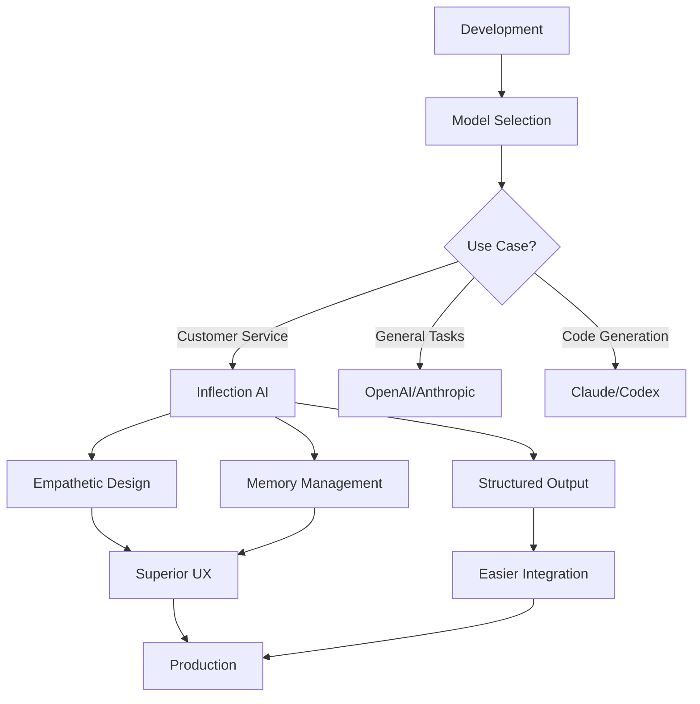

# Inflection AI — Deep Dive | Monday, April 20, 2026

## Company Overview

Inflection AI has undergone one of the most dramatic pivots in the AI industry, transforming from a consumer-focused personal AI company to an enterprise-focused, API-driven AI provider. Founded with the ambitious goal of creating truly empathetic artificial intelligence, the company initially captured the world's attention with **Pi** — their "Personal Intelligence" chatbot designed to be a friendly, emotionally intelligent conversational companion.

Under new leadership, Inflection transitioned away from frontier model development and consumer products to concentrate on real-world enterprise applications. This strategic shift positions them as a specialized player in the rapidly growing enterprise AI market, which is projected to reach **$1.81 trillion by 2030**. The company's mission has evolved from democratizing personal AI to delivering reliable, production-ready AI solutions for businesses.

Inflection's core products now center around their **Inflection 2.5** model and related enterprise APIs, which maintain the empathetic design principles that made Pi popular while adding the reliability and scalability that enterprises demand. Their technology stack emphasizes conversational memory, empathetic design, and structured output capabilities that make it particularly valuable for customer service, human resources, and knowledge management applications.

The company's partnership with **Microsoft** has been instrumental in their pivot, with Inflection leveraging Azure AI infrastructure to accelerate development time and reduce downtime. This collaboration has positioned Inflection to better compete in the enterprise space while maintaining access to world-class computing resources.

## Latest News & Announcements

### **Enterprise Pivot Completed** — Inflection AI has successfully completed its transition from consumer-focused personal AI to an enterprise-focused, API-driven provider. The company shifted away from frontier model development and consumer products to concentrate on real-world enterprise applications. [Source](https://www.artificial-intelligence.blog/ai-companies/inflection-ai)

### **Microsoft Partnership Deepens** — Inflection AI is bringing conversational AI to the forefront through its collaboration with Microsoft. The partnership focuses on accelerating time to development and reducing downtime, better positioning the company to be a leader in the AI space. The integration with Azure AI infrastructure provides scalable computing resources for enterprise deployments. [Source](https://www.microsoft.com/en/customers/story/1666598146786087377-inflection-ai-partner-professional-services-azure-ai-infrastructure)

### **AI SDK Community Provider Released** — An unofficial Inflection AI provider for the AI SDK has been released, enabling developers to integrate Inflection's models more easily into their applications. The community-driven initiative demonstrates growing developer interest in Inflection's technology beyond official channels. [Source](https://ai-sdk.dev/providers/community-providers/inflection-ai)

### **Developer Cookbook Launches** — The Inflection AI Cookbook repository has been published on GitHub, providing developers with comprehensive guides and examples for using the Inflection AI API. The cookbook includes automated testing tools, XML output conversion, and structured test reports for software testing workflows. [Source](https://github.com/Inflection-Ops/inflection-ai-cookbook)

### **Industry-wide AI Inflection Point** — The broader AI industry has reached what Nvidia CEO Jensen Huang calls the "agentic AI inflection point," with demand for AI inference surging. This macro trend bodes well for Inflection's enterprise pivot, as organizations seek specialized AI solutions that can deliver tangible business outcomes. [Source](https://www.cnet.com/tech/services-and-software/nvidias-jensen-huang-agentic-ai-inflection-point/)

### **Enterprise AI Adoption Surges** — According to industry reports, **78% of enterprises deployed AI in 2025**, creating massive demand for reliable enterprise AI providers. However, many enterprises struggle to translate AI into scalable outcomes, creating an opportunity for specialized providers like Inflection that focus on operational excellence. [Source](https://www.unite.ai/the-ai-reckoning-infrastructure-gap-enterprise-adoption/)

## Product & Technology Deep Dive

### Inflection 2.5 / Pi — Empathetic Conversational AI

At the heart of Inflection's technology stack is the **Inflection 2.5** model, often referred to by its consumer-facing name **Pi**. This model represents a significant departure from traditional large language models in its design philosophy: while most LLMs prioritize raw capability and task completion, Inflection 2.5 was engineered from the ground up for **empathetic, emotionally intelligent conversation**.

The model's architecture incorporates several innovations that distinguish it in the crowded AI landscape:

**Conversational Memory** — Unlike standard chatbots that treat each interaction as independent, Inflection 2.5 maintains sophisticated context across sessions. This enables truly personalized conversations where the AI remembers preferences, past discussions, and emotional context. For enterprise applications, this translates to customer service bots that remember user history and HR assistants that track employee interactions over time.

**Empathetic Design Principles** — The training methodology for Inflection 2.5 emphasizes emotional intelligence and appropriate tone adjustment. The model can detect user emotional states and adapt its responses accordingly — a critical feature for applications in mental health support, customer service, and employee engagement. This capability sets Inflection apart from competitors that prioritize raw intelligence over emotional resonance.

**Structured Output Capabilities** — Recent updates to the Inflection API include robust support for structured outputs, particularly XML format. This enables seamless integration with enterprise systems, automated pipelines, and data processing workflows. The ability to generate validated, consistent structured data makes Inflection particularly valuable for automation use cases.

### Enterprise API Infrastructure

Inflection's enterprise offering is built around a modern API infrastructure designed for production deployments:

**Reliability & Uptime** — Leveraging Microsoft's Azure AI infrastructure, Inflection delivers enterprise-grade reliability with minimal downtime. The partnership ensures access to scalable GPU compute resources, which is critical as the industry faces unprecedented demand for AI inference capacity.

**Testing & Quality Assurance** — The Inflection AI Cookbook includes automated testing tools that validate model outputs across a wide range of scenarios. This ensures high coverage and reliability in software testing, addressing a key enterprise concern about AI consistency and predictability.

**Developer-Friendly Integration** — With community SDK support for multiple languages (including the PHP client for Pi.ai), Inflection has made it straightforward for development teams to integrate their models into existing applications. The unofficial AI SDK provider further expands accessibility across different tech stacks.

### Technology Architecture

```
┌─────────────────────────────────────────────────────────────┐
│                    Enterprise Applications                   │
│  ┌──────────────┐  ┌──────────────┐  ┌──────────────┐      │
│  │ Customer     │  │ HR           │  │ Knowledge    │      │
│  │ Service      │  │ Assistant    │  │ Management   │      │
│  └──────┬───────┘  └──────┬───────┘  └──────┬───────┘      │
└─────────┼──────────────────┼──────────────────┼─────────────┘
          │                  │                  │
          └──────────────────┼──────────────────┘
                             │
                ┌────────────▼────────────┐
                │   Inflection API Layer   │
                │  • REST Endpoints        │
                │  • WebSocket Support     │
                │  • Structured Output     │
                │  • Rate Limiting         │
                └────────────┬────────────┘
                             │
                ┌────────────▼────────────┐
                │   Inflection 2.5 / Pi    │
                │  • Empathetic Engine     │
                │  • Memory System         │
                │  • Context Management    │
                └────────────┬────────────┘
                             │
                ┌────────────▼────────────┐
                │  Azure AI Infrastructure │
                │  • GPU Compute           │
                │  • Scalable Storage      │
                │  • Global CDN           │
                └─────────────────────────┘
```

This architecture enables Inflection to deliver the emotional intelligence that made Pi popular while meeting the rigorous demands of enterprise deployments.

## GitHub & Open Source

Inflection AI's presence on GitHub reflects their enterprise pivot and community engagement strategy. While they maintain some official repositories, much of the development activity around their technology comes from the broader developer community.

### Official Repositories

**[InflectionAI Organization](https://github.com/InflectionAI)**
- The official GitHub organization serves as the hub for Inflection's open-source initiatives
- Activity includes integration with various AI tools and platforms
- Commit activity shows ongoing development and maintenance

### Community Repositories

**[Inflection-Ops/inflection-ai-cookbook](https://github.com/Inflection-Ops/inflection-ai-cookbook)**
- A comprehensive developer guide with examples for using the Inflection AI API
- Features automated testing capabilities for Inflection LLM outputs
- Includes XML output conversion for structured data integration
- Generates structured test reports for easy analysis and debugging
- This repository demonstrates strong community engagement and provides practical resources for developers

**[maximerenou/php-pi-chat](https://github.com/maximerenou/php-pi-chat)**
- PHP client library for Pi.ai chatbot (Inflection AI)
- Enables PHP developers to integrate Inflection's conversational AI into web applications
- Represents the growing ecosystem of language-specific SDKs

**[hansfzlorenzana/Inflection-Pi-API](https://github.com/hansfzlorenzana/Inflection-Pi-API)**
- Reverse engineered API implementation for Personal Intelligence (Pi)
- Demonstrates developer interest in accessing Inflection's technology through unofficial channels
- Highlights the demand for more open access to Inflection's capabilities

### Community Recognition

Inflection AI is recognized in broader AI community projects:

**[Zijian-Ni/awesome-ai-agents-2026](https://github.com/Zijian-Ni/awesome-ai-agents-2026)**
- Curated list of AI Agent frameworks featuring Inflection 2.5 / Pi
- Listed as "Empathetic conversational AI model" and "Friendly personal AI companion"
- Inclusion in this prominent repository indicates recognition within the AI agent ecosystem

**[inflection-ai GitHub Topic](https://github.com/topics/inflection-ai)**
- Dedicated topic page aggregates all repositories related to Inflection AI
- Serves as a discovery hub for developers interested in Inflection's technology

### Developer Ecosystem Integration

Inflection's technology integrates with several prominent AI development frameworks:

- **AI SDK**: Community provider available for seamless integration
- **AgentList**: Listed among conversational AI platforms alongside Perplexity and Replika
- **Multi-framework Support**: Compatible with various agent orchestration tools

The GitHub ecosystem around Inflection AI, while not as extensive as some larger competitors, shows healthy community engagement and growing developer interest. The presence of multiple community-maintained SDKs and tools indicates genuine demand for their technology, particularly the empathetic conversational capabilities that distinguish their offerings.

## Getting Started — Code Examples

### Example 1: Basic API Integration with Python

This example demonstrates how to set up a basic conversation with Inflection's Pi model using Python. The code shows authentication, message sending, and response handling.

```python
import requests
import json

class InflectionClient:
    """
    A simple client for interacting with Inflection AI's API.
    This handles authentication and message exchange with the Pi model.
    """
    
    def __init__(self, api_key: str, base_url: str = "https://api.inflection.ai/v1"):
        self.api_key = api_key
        self.base_url = base_url
        self.headers = {
            "Authorization": f"Bearer {api_key}",
            "Content-Type": "application/json"
        }
        self.conversation_id = None
    
    def start_conversation(self) -> dict:
        """Initialize a new conversation session"""
        response = requests.post(
            f"{self.base_url}/conversations",
            headers=self.headers
        )
        response.raise_for_status()
        data = response.json()
        self.conversation_id = data["conversation_id"]
        return data
    
    def send_message(self, message: str, empathetic_mode: bool = True) -> dict:
        """
        Send a message to Pi and receive a response.
        
        Args:
            message: The user's message text
            empathetic_mode: Enable empathetic response tuning
        
        Returns:
            Response dictionary with AI message and metadata
        """
        if not self.conversation_id:
            self.start_conversation()
        
        payload = {
            "conversation_id": self.conversation_id,
            "message": message,
            "model": "inflection-2.5",
            "parameters": {
                "empathetic_mode": empathetic_mode,
                "temperature": 0.7,
                "max_tokens": 500
            }
        }
        
        response = requests.post(
            f"{self.base_url}/chat/completions",
            headers=self.headers,
            json=payload
        )
        response.raise_for_status()
        return response.json()
    
    def get_conversation_history(self) -> list:
        """Retrieve the full conversation history"""
        if not self.conversation_id:
            return []
        
        response = requests.get(
            f"{self.base_url}/conversations/{self.conversation_id}/history",
            headers=self.headers
        )
        response.raise_for_status()
        return response.json()["messages"]


# Usage Example
if __name__ == "__main__":
    # Initialize client with your API key
    client = InflectionClient(api_key="your-api-key-here")
    
    # Start a conversation
    print("Pi: Hello! I'm Pi, your personal AI assistant. How can I help you today?")
    
    # Interactive chat loop
    while True:
        user_input = input("\nYou: ")
        if user_input.lower() in ["exit", "quit", "bye"]:
            print("Pi: Goodbye! Take care!")
            break
        
        response = client.send_message(user_input)
        ai_message = response["choices"][0]["message"]["content"]
        print(f"\nPi: {ai_message}")
```

### Example 2: Enterprise Integration with Structured XML Output

This advanced example shows how to use Inflection's structured output capabilities for enterprise automation. It demonstrates generating XML-formatted data that can be directly integrated into business systems.

```python
import requests
import xml.etree.ElementTree as ET
from typing import Dict, Any
from dataclasses import dataclass

@dataclass
class CustomerInquiry:
    """Data structure for customer service inquiries"""
    customer_id: str
    inquiry_type: str
    urgency: str
    sentiment: str
    summary: str
    suggested_action: str
    follow_up_required: bool


class InflectionEnterpriseClient:
    """
    Enterprise client for Inflection AI with structured output support.
    Designed for customer service, HR, and knowledge management applications.
    """
    
    def __init__(self, api_key: str):
        self.api_key = api_key
        self.base_url = "https://api.inflection.ai/v1/enterprise"
        self.headers = {
            "Authorization": f"Bearer {api_key}",
            "Content-Type": "application/json",
            "X-Output-Format": "xml"  # Request structured XML output
        }
    
    def analyze_customer_inquiry(
        self, 
        customer_id: str, 
        conversation_text: str,
        customer_history: str = ""
    ) -> CustomerInquiry:
        """
        Analyze a customer inquiry and extract structured information.
        
        This demonstrates Inflection's ability to understand context,
        detect sentiment, and provide actionable insights.
        """
        system_prompt = f"""
        You are an empathetic customer service analyst. Analyze the following 
        customer conversation and extract key information in XML format.
        
        Customer ID: {customer_id}
        Customer History: {customer_history}
        
        Provide analysis in this XML structure:
        <analysis>
            <inquiry_type>[category]</inquiry_type>
            <urgency>[low|medium|high|critical]</urgency>
            <sentiment>[positive|neutral|negative|frustrated]</sentiment>
            <summary>[brief summary]</summary>
            <suggested_action>[recommended response]</suggested_action>
            <follow_up_required>[true|false]</follow_up_required>
        </analysis>
        """
        
        payload = {
            "model": "inflection-2.5-enterprise",
            "messages": [
                {"role": "system", "content": system_prompt},
                {"role": "user", "content": conversation_text}
            ],
            "parameters": {
                "temperature": 0.3,  # Lower temperature for consistent structured output
                "response_format": {"type": "xml_object"}
            }
        }
        
        response = requests.post(
            f"{self.base_url}/analyze",
            headers=self.headers,
            json=payload
        )
        response.raise_for_status()
        
        # Parse XML response
        xml_content = response.json()["content"]
        root = ET.fromstring(xml_content)
        
        return CustomerInquiry(
            customer_id=customer_id,
            inquiry_type=root.find("inquiry_type").text,
            urgency=root.find("urgency").text,
            sentiment=root.find("sentiment").text,
            summary=root.find("summary").text,
            suggested_action=root.find("suggested_action").text,
            follow_up_required=root.find("follow_up_required").text.lower() == "true"
        )
    
    def generate_empathetic_response(
        self,
        inquiry: CustomerInquiry,
        company_guidelines: str = ""
    ) -> str:
        """
        Generate an empathetic response based on the inquiry analysis.
        This leverages Inflection's core strength in emotionally intelligent conversation.
        """
        prompt = f"""
        Generate an empathetic response to this customer inquiry:
        
        Inquiry Type: {inquiry.inquiry_type}
        Urgency: {inquiry.urgency}
        Customer Sentiment: {inquiry.sentiment}
        Summary: {inquiry.summary}
        
        Company Guidelines: {company_guidelines}
        
        The response should:
        - Acknowledge the customer's feelings
        - Address their concern directly
        - Provide the suggested action naturally
        - Maintain appropriate tone based on sentiment
        """
        
        payload = {
            "model": "inflection-2.5",
            "messages": [
                {
                    "role": "system", 
                    "content": "You are an empathetic customer service representative. "
                              "Prioritize emotional connection while solving problems."
                },
                {"role": "user", "content": prompt}
            ],
            "parameters": {
                "empathetic_mode": True,
                "temperature": 0.8
            }
        }
        
        response = requests.post(
            f"{self.base_url}/generate",
            headers=self.headers,
            json=payload
        )
        response.raise_for_status()
        
        return response.json()["choices"][0]["message"]["content"]


# Enterprise Usage Example
if __name__ == "__main__":
    client = InflectionEnterpriseClient(api_key="your-enterprise-api-key")
    
    # Example customer conversation
    conversation = """
    Customer: I've been waiting for my refund for two weeks now. This is 
    ridiculous! I ordered on March 1st and your website said 5-7 business days.
    I'm really disappointed with this service.
    
    Agent: I apologize for the delay. Let me check the status for you...
    
    Customer: I've already called three times. Every time I get a different 
    answer. This is unacceptable. I need this resolved today or I'm filing 
    a complaint with the Better Business Bureau.
    """
    
    # Analyze the inquiry
    inquiry = client.analyze_customer_inquiry(
        customer_id="CUST-2026-04198",
        conversation_text=conversation
    )
    
    print("=== Inquiry Analysis ===")
    print(f"Type: {inquiry.inquiry_type}")
    print(f"Urgency: {inquiry.urgency}")
    print(f"Sentiment: {inquiry.sentiment}")
    print(f"Summary: {inquiry.summary}")
    print(f"Suggested Action: {inquiry.suggested_action}")
    print(f"Follow-up Required: {inquiry.follow_up_required}")
    
    # Generate empathetic response
    response = client.generate_empathetic_response(inquiry)
    print(f"\n=== Suggested Response ===\n{response}")
```

### Example 3: Automated Testing with Inflection AI

This example demonstrates using Inflection's automated testing capabilities, a key feature for enterprise reliability. It shows how to validate AI outputs across test scenarios.

```python
import pytest
import requests
from typing import List, Dict, Any
from dataclasses import dataclass
from enum import Enum


class TestResult(Enum):
    PASS = "pass"
    FAIL = "fail"
    INCONCLUSIVE = "inconclusive"


@dataclass
class TestCase:
    """Test case for validating AI responses"""
    name: str
    input_prompt: str
    expected_criteria: Dict[str, Any]
    category: str


@dataclass
class TestExecution:
    """Result of executing a single test case"""
    test_case: TestCase
    result: TestResult
    actual_output: str
    criteria_met: Dict[str, bool]
    execution_time_ms: float


class InflectionTestRunner:
    """
    Automated testing framework for Inflection AI outputs.
    Ensures high coverage and reliability in software testing.
    Generates structured test reports for easy analysis and debugging.
    """
    
    def __init__(self, api_key: str):
        self.api_key = api_key
        self.base_url = "https://api.inflection.ai/v1"
        self.headers = {
            "Authorization": f"Bearer {api_key}",
            "Content-Type": "application/json"
        }
    
    def generate_response(self, prompt: str, model: str = "inflection-2.5") -> str:
        """Generate a response from the Inflection model"""
        payload = {
            "model": model,
            "messages": [{"role": "user", "content": prompt}],
            "parameters": {"temperature": 0.7, "max_tokens": 500}
        }
        
        response = requests.post(
            f"{self.base_url}/chat/completions",
            headers=self.headers,
            json=payload
        )
        response.raise_for_status()
        return response.json()["choices"][0]["message"]["content"]
    
    def evaluate_criteria(
        self, 
        output: str, 
        criteria: Dict[str, Any]
    ) -> Dict[str, bool]:
        """
        Evaluate if the output meets specified criteria.
        This can be extended with more sophisticated validation logic.
        """
        results = {}
        
        if "min_length" in criteria:
            results["min_length"] = len(output) >= criteria["min_length"]
        
        if "max_length" in criteria:
            results["max_length"] = len(output) <= criteria["max_length"]
        
        if "contains_keywords" in criteria:
            keywords = criteria["contains_keywords"]
            results["contains_keywords"] = all(
                keyword.lower() in output.lower() 
                for keyword in keywords
            )
        
        if "empathetic_tone" in criteria:
            empathetic_indicators = ["understand", "sorry", "help", "care"]
            results["empathetic_tone"] = any(
                indicator in output.lower() 
                for indicator in empathetic_indicators
            )
        
        if "no_negative_words" in criteria:
            negative_words = ["never", "impossible", "can't", "won't"]
            results["no_negative_words"] = not any(
                word in output.lower() 
                for word in negative_words
            )
        
        return results
    
    def run_test(self, test_case: TestCase) -> TestExecution:
        """Execute a single test case and return results"""
        import time
        
        start_time = time.time()
        output = self.generate_response(test_case.input_prompt)
        execution_time = (time.time() - start_time) * 1000
        
        criteria_results = self.evaluate_criteria(
            output, 
            test_case.expected_criteria
        )
        
        # Determine overall test result
        all_passed = all(criteria_results.values())
        if all_passed:
            result = TestResult.PASS
        elif any(criteria_results.values()):
            result = TestResult.FAIL
        else:
            result = TestResult.INCONCLUSIVE
        
        return TestExecution(
            test_case=test_case,
            result=result,
            actual_output=output,
            criteria_met=criteria_results,
            execution_time_ms=execution_time
        )
    
    def generate_test_report(self, executions: List[TestExecution]) -> str:
        """Generate a structured test report"""
        total_tests = len(executions)
        passed = sum(1 for e in executions if e.result == TestResult.PASS)
        failed = sum(1 for e in executions if e.result == TestResult.FAIL)
        inconclusive = sum(1 for e in executions if e.result == TestResult.INCONCLUSIVE)
        
        report = f"""
=== Inflection AI Test Report ===
Total Tests: {total_tests}
Passed: {passed} ({passed/total_tests*100:.1f}%)
Failed: {failed} ({failed/total_tests*100:.1f}%)
Inconclusive: {inconclusive} ({inconclusive/total_tests*100:.1f}%)

=== Test Results ===
"""
        
        for execution in executions:
            status_icon = {
                TestResult.PASS: "✓",
                TestResult.FAIL: "✗",
                TestResult.INCONCLUSIVE: "?"
            }[execution.result]
            
            report += f"""
{status_icon} {execution.test_case.name}
  Category: {execution.test_case.category}
  Execution Time: {execution.execution_time_ms:.2f}ms
  Criteria Met: {execution.criteria_met}
  Output: {execution.actual_output[:100]}...
"""
        
        return report


# Pytest Integration
@pytest.fixture
def test_runner():
    """Fixture for Inflection test runner"""
    return InflectionTestRunner(api_key="test-api-key")


def test_empathetic_customer_service(test_runner):
    """Test empathetic responses for customer service scenarios"""
    test_case = TestCase(
        name="Empathetic Response to Frustrated Customer",
        input_prompt="I've been waiting for my refund for two weeks! This is ridiculous!",
        expected_criteria={
            "min_length": 50,
            "empathetic_tone": True,
            "contains_keywords": ["help", "apologize"]
        },
        category="customer_service"
    )
    
    execution = test_runner.run_test(test_case)
    assert execution.result == TestResult.PASS


def test_technical_support_clarity(test_runner):
    """Test technical support responses are clear and helpful"""
    test_case = TestCase(
        name="Clear Technical Support Response",
        input_prompt="My application keeps crashing when I try to upload files",
        expected_criteria={
            "min_length": 75,
            "contains_keywords": ["troubleshoot", "solution", "steps"],
            "no_negative_words": False  # Technical terms are okay
        },
        category="technical_support"
    )
    
    execution = test_runner.run_test(test_case)
    assert execution.result == TestResult.PASS


# Standalone execution
if __name__ == "__main__":
    runner = InflectionTestRunner(api_key="your-api-key")
    
    # Define test suite
    test_cases = [
        TestCase(
            name="Customer Empathy Test",
            input_prompt="I'm very frustrated with your service!",
            expected_criteria={
                "empathetic_tone": True,
                "min_length": 30
            },
            category="empathy"
        ),
        TestCase(
            name="Technical Clarity Test",
            input_prompt="How do I reset my password?",
            expected_criteria={
                "contains_keywords": ["step", "follow", "click"],
                "min_length": 50
            },
            category="technical"
        ),
        TestCase(
            name="Professional Tone Test",
            input_prompt="Tell me about your enterprise pricing",
            expected_criteria={
                "min_length": 40,
                "no_negative_words": True
            },
            category="professional"
        )
    ]
    
    # Run all tests
    executions = [runner.run_test(tc) for tc in test_cases]
    
    # Generate and print report
    print(runner.generate_test_report(executions))
```

## Market Position & Competition

Inflection AI operates in a highly competitive enterprise AI market, differentiated primarily by its focus on **empathetic conversational AI** rather than raw model capability or general-purpose intelligence. This positioning is both a strength and a strategic choice that defines their competitive landscape.

### Competitive Analysis

| Aspect | Inflection AI | OpenAI | Anthropic | Google | Enterprise Cohort |
|--------|---------------|--------|-----------|--------|-------------------|
| **Primary Focus** | Empathetic conversation | General capability | Safety & reasoning | Search integration | Domain-specific |
| **Model Strength** | Emotional intelligence | Versatility | Constitutional AI | Multimodal | Specialized tasks |
| **Enterprise Features** | Structured output, testing | Advanced APIs | Claude Pro | Vertex AI | Custom solutions |
| **Pricing Position** | Mid-tier | Premium | Premium | Variable | Competitive |
| **Key Differentiator** | Empathy + Memory | Ecosystem | Safety | Integration | Niche expertise |
| **Target Market** | Customer service, HR, KM | All sectors | Enterprise, research | Google ecosystem | Vertical markets |

### Market Dynamics

The enterprise AI market is experiencing unprecedented growth, with **78% of enterprises deploying AI in 2025** and projections reaching **$1.81 trillion by 2030**. However, this growth masks a critical challenge: many enterprises struggle to translate AI investments into tangible outcomes. Inflection's focused approach addresses this pain point by offering specialized capabilities rather than trying to be everything to everyone.

### Competitive Advantages

**Emotional Intelligence Specialization** — While competitors focus on raw intelligence and capability benchmarks, Inflection has carved out a unique position with models specifically designed for empathetic interaction. This is particularly valuable in customer service, HR, and mental health applications where emotional resonance matters more than raw knowledge retrieval.

**Enterprise-Ready Testing Infrastructure** — The automated testing capabilities in the Inflection AI Cookbook address a critical enterprise concern: reliability and predictability. Most competitors leave testing to customers, while Inflection provides built-in tools for validating AI outputs across scenarios.

**Structured Output Integration** — The robust XML output capabilities and focus on data interoperability make Inflection particularly well-suited for enterprise integration scenarios. This technical advantage translates to faster deployment times and lower integration costs.

**Microsoft Partnership** — The collaboration with Azure AI infrastructure provides Inflection with enterprise-grade computing resources and credibility that smaller competitors struggle to match. This partnership enables them to compete on infrastructure reliability while maintaining focus on their core model differentiation.

### Competitive Challenges

**Model Capability Gap** — Inflection's decision to pivot away from frontier model development means they cannot compete on raw benchmarks against companies like OpenAI, Anthropic, and Google that continue to push capability boundaries. For enterprises prioritizing maximum intelligence over empathy, this is a significant drawback.

**Limited Ecosystem** — Compared to OpenAI's extensive plugin ecosystem and Google's integration across productivity tools, Inflection's ecosystem remains relatively small. The community-driven SDK development shows promise but lags behind established players.

**Brand Recognition** — While Pi gained consumer attention, the enterprise pivot means competing for mindshare against well-established enterprise AI vendors. Building trust with CIOs and CTOs requires significant investment in sales, marketing, and proof-of-concept deployments.

**Market Timing** — The broader AI industry has reached what Nvidia CEO Jensen Huang calls the "agentic AI inflection point," with demand surging for more autonomous, agent-like systems. Inflection's conversational focus may miss this wave unless they adapt their technology to support agentic workflows.

### Pricing Position

Inflection occupies a mid-tier pricing position — more expensive than smaller competitors but below the premium pricing of OpenAI and Anthropic. This positioning makes them attractive to mid-market enterprises that need capabilities beyond basic LLMs but cannot justify premium pricing for general-purpose models.

### Strategic Outlook

Inflection's best competitive strategy is to double down on their empathetic AI specialization rather than attempting to compete on general capabilities. The enterprise market increasingly values specialized, reliable solutions over general-purpose models, and Inflection is well-positioned to serve customers where emotional intelligence and conversational memory are critical differentiators.

## Developer Impact

For developers and technical decision-makers, Inflection AI's evolution from consumer darling to enterprise provider presents both opportunities and considerations. The company's pivot has created a unique set of tools and capabilities that address specific developer pain points, particularly in the realm of building emotionally intelligent applications.

### Who Should Use Inflection AI?

**Customer Service Platform Developers** — If you're building customer service chatbots, support ticketing systems, or customer engagement platforms, Inflection's empathetic models offer significant advantages over traditional LLMs. The ability to detect customer sentiment, adapt tone appropriately, and maintain conversation context across sessions addresses the most common failure points in customer service AI.

**HR Tech Builders** — For developers working on human resources platforms, employee assistance tools, or internal communication systems, Inflection's emotional intelligence and memory capabilities enable more natural interactions. The structured output support also facilitates integration with HR systems and databases.

**Knowledge Management Teams** — Developers building enterprise search, documentation assistants, or training platforms can leverage Inflection's conversational memory to create more contextually aware systems that understand user intent and maintain context across queries.

**Conversational Interface Specialists** — If your focus is on creating voice interfaces, chat applications, or any system where natural conversation is the primary interaction mode, Inflection's specialized training for empathetic dialogue provides better user experiences than general-purpose models.

### Technical Advantages for Developers

**Structured Output Reliability** — The robust XML output support and validation capabilities significantly reduce the integration burden. Unlike many LLMs that require extensive prompt engineering and post-processing to extract structured data, Inflection's models generate validated, consistent outputs that can be directly consumed by enterprise systems.

**Testing Infrastructure** — The automated testing tools included in the Inflection AI Cookbook address a critical gap in AI development. Most LLM providers leave testing entirely to developers, requiring custom solutions for validating model behavior. Inflection's built-in testing framework reduces development time and increases confidence in production deployments.

**Multi-Language SDK Support** — With community-maintained clients for Python, PHP, and integration with the AI SDK, developers can work with their preferred languages and frameworks rather than being forced into a specific tech stack.

**Enterprise-Grade Reliability** — The Microsoft Azure partnership provides infrastructure reliability that smaller LLM providers cannot match. For developers building mission-critical applications, the guaranteed uptime and scalable compute resources reduce operational complexity.

### Development Workflow Impact

Integrating Inflection AI into development workflows offers several advantages:



### Learning Curve and Onboarding

For developers familiar with other LLM APIs, transitioning to Inflection is straightforward. The API follows familiar patterns, and the extensive documentation in the community cookbook reduces onboarding time. However, developers should invest time in understanding:

- **Empathetic Prompting** — Crafting prompts that leverage the model's emotional intelligence requires different techniques than traditional LLM prompting
- **Memory Management** — Understanding how to effectively use conversation memory across sessions
- **Structured Output Design** — Designing XML schemas that work well with the model's generation patterns

### Production Considerations

When deploying Inflection AI in production, developers should consider:

**Cost Optimization** — While Inflection's pricing is competitive, the empathetic capabilities may require longer context windows and more tokens per interaction. Implementing caching for common queries and optimizing prompt length can help control costs.

**Latency Management** — The emotional intelligence processing may add latency compared to simpler models. Implementing streaming responses and appropriate timeout handling is essential for good user experience.

**Fallback Strategies** — As with any AI service, implementing fallback mechanisms for service outages or rate limiting is crucial. The structured output format makes it easier to integrate with alternative providers when needed.

**Monitoring and Observability** — Leveraging the built-in testing framework for ongoing monitoring of model behavior in production, with automated alerts for quality degradation or unexpected outputs.

### Community and Support

The growing community around Inflection AI, evidenced by multiple GitHub repositories and SDK projects, provides developers with resources and peer support. However, compared to OpenAI and Anthropic, the ecosystem is smaller, which means:

- Fewer third-party integrations and tools
- Less community-generated content and examples
- More reliance on official documentation and the community cookbook

For developers who value strong community support and extensive third-party ecosystems, this may be a consideration. However, for those who prioritize specialized capabilities over ecosystem breadth, Inflection's focused approach offers compelling advantages.

### Verdict for Developers

Inflection AI is an excellent choice for developers building applications where:

- Emotional intelligence and empathetic conversation are core features
- Structured, reliable output is required for system integration
-

---

*Generated on 2026-04-20 by [AI Tech Daily Agent](https://github.com/gautammanak1/ai-tech-daily-agent) — Deep dive on Inflection AI*
