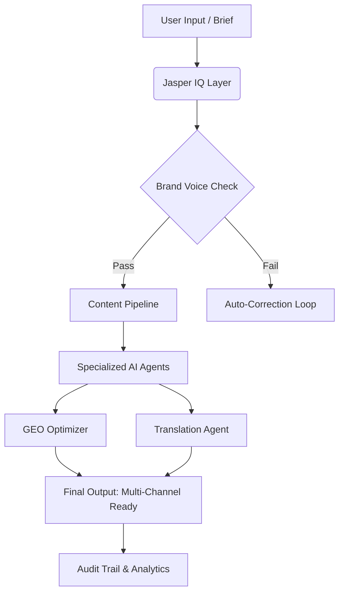

# Jasper AI — Deep Dive | Friday, August 14, 2026


*Figure 1: The Jasper AI logo, representing the shift from simple copywriting to agentic marketing infrastructure.*

## Company Overview

Jasper has undergone a radical transformation since its inception. Founded in early 2021 by Dave Rogenmoser, Chris Hull, and John Philip Morgan, the company initially gained traction as an "AI writing assistant" for individual creators. However, under the leadership of CEO Timothy Young (formerly President of Dropbox), who took over in September 2023, Jasper pivoted decisively toward enterprise infrastructure.

Today, Jasper is not merely a tool; it is an **Agentic Marketing Platform**. It serves as the core operating system for marketing teams within large organizations. As of mid-2026, Jasper boasts over **100,000 paid enterprise users**, including nearly **20% of the Fortune 500** companies. Notable clients include Prudential, Wayfair, and Ulta Beauty.

The company’s financial journey has been steep. By October 2022, Jasper had raised a **$125 million Series A** led by Insight Partners, achieving a valuation of **$1.5 billion**. This funding fueled the development of their proprietary "Jasper IQ" layer and the expansion of their agent ecosystem.

In August 2026, Jasper strengthened its executive leadership further, announcing the promotion of **Tom Newton to Chief Marketing Officer** on August 4, 2026, signaling a continued focus on scaling enterprise adoption and refining go-to-market strategies for complex B2B environments [source](https://www.aol.com/articles/jasper-strengthens-executive-leadership-next-130000000.html).

**Key Stats:**
*   **Founded:** 2021
*   **CEO:** Timothy Young
*   **Valuation:** $1.5 Billion (Series A baseline)
*   **Enterprise Users:** >100,000
*   **Fortune 500 Penetration:** ~20%
*   **Core Mission:** To transform marketing from ad-hoc experimentation into governed, scalable automation.

## Latest News & Announcements

The landscape for Jasper in August 2026 is defined by strategic leadership shifts and critical product updates addressing the "AI Search" revolution.

*   **Executive Leadership Update:** On August 4, 2026, Jasper announced the promotion of Tom Newton to Chief Marketing Officer. This move is aimed at strengthening executive leadership for the next era of enterprise marketing, ensuring that sales and marketing operations are tightly aligned with the platform's new agentic capabilities [source](https://www.aol.com/articles/jasper-strengthens-executive-leadership-next-130000000.html).

*   **GEO Hub & AI Answer Engine Optimization:** In June 2026, Jasper released significant updates to its "GEO Hub." This feature allows marketers to measure how their brand appears across major AI answer engines like ChatGPT, Claude, and Gemini. It provides visibility into brand presence rate, citation rate, sentiment, and competitive share of voice, enabling teams to fix brand drift directly within the platform [source](https://www.jasper.ai/blog/whats-new-in-june-2026).

*   **Translation Agent Launch:** Also part of the June 2026 update, Jasper introduced a specialized Translation Agent. This tool localizes content into **27 languages** (including Chinese, Japanese, Korean, Arabic, Hindi, and major European languages) while preserving brand terminology via Jasper IQ. It ensures global campaigns feel native rather than just technically translated [source](https://www.jasper.ai/blog/whats-new-in-june-2026).

*   **Market Reality Check:** Recent industry reports highlight that while 63% of organizations have adopted generative AI, 51% still cannot effectively track ROI. Jasper positions itself as the solution to this gap by providing audit trails and governance that generic LLMs lack [source](https://ai-cmo.net/tools/jasper-ai).

*(Note: Unrelated local news regarding incidents in Jasper, Texas, such as the June 26 shooting at a Sonic drive-in, is excluded from this technical analysis as it pertains to geographic location only and not the technology company.)* [source](https://www.msn.com/en-us/news/other/2-juveniles-shot-at-sonic-in-jasper-while-watching-fight/ar-AA26D5VF?ocid=BingNewsVerp)

## Product & Technology Deep Dive

Jasper’s architecture in 2026 is built on three distinct layers: **Perception**, **Execution**, and **Automation**. This structure moves beyond simple text generation to create a closed-loop marketing system.

### 1. Jasper IQ: The Brand Governance Layer
This is Jasper’s primary differentiator against competitors like ChatGPT or generic LLM wrappers. Jasper IQ consists of three modules:
*   **Brand IQ:** Acts as a "brand guardian." Users upload tone guidelines, style guides, and forbidden words. Through "Voice Analysis," Jasper reverse-engineers brand rules from existing high-performing copy, ensuring every output aligns with the company’s unique personality.
*   **Marketing IQ:** Embeds marketing logic directly into the model. It includes specific algorithms for SEO (Search Engine Optimization), AEO (Answer Engine Optimization), and GEO (Generative Engine Optimization). This ensures content is optimized for both traditional search and AI-driven discovery.
*   **Knowledge Base:** Serves as the enterprise memory bank. Users can upload PDFs, Word docs, URLs, and video scripts. When generating content, Jasper pulls from these verified data points, drastically reducing hallucinations and ensuring factual accuracy.

### 2. Content Pipelines
For enterprise scale, manual creation is impossible. Content Pipelines automate entire marketing campaigns. They allow teams to define triggers (e.g., "new blog post published") and actions (e.g., "generate social media snippets," "update email newsletter," "create LinkedIn post"). This enables the production of **5-10x more content** while maintaining consistency.

### 3. AI Agents
Jasper now hosts over **100 specialized agents**. These are not just chatbots but autonomous workers designed for specific tasks:
*   **Research Agents:** Scrape and synthesize competitor data.
*   **Copy Agents:** Draft articles, ads, and emails based on brand voice.
*   **GEO Agents:** Specifically tasked with optimizing content for AI answer engines.
*   **Translation Agents:** Localize content while preserving context.

### Architecture Diagram Concept


## GitHub & Open Source

Unlike many developer-centric AI tools, Jasper’s core intellectual property remains largely proprietary. However, there is activity in the surrounding ecosystem and community contributions.

*   **Official Presence:** The official organization `gojasper` exists on GitHub with approximately **75 followers**. It primarily hosts documentation and limited public resources related to their API integrations and internal tools like "LBM" (Latent Bridge Matching) for image-to-image processing [source](https://github.com/gojasper).
*   **Community Repositories:** Several third-party repositories demonstrate how developers are integrating Jasper or building upon similar concepts:
    *   `goodindustries/jasper`: A personal project showcasing calendar and email read-only tools exposed through provider lanes, hinting at broader agent interoperability [source](https://github.com/goodindustries/jasper).
    *   `dxtavz82/jasper`: A review repository detailing Jasper AI as an enterprise-focused marketing platform using AI agents [source](https://github.com/dxtavz82/jasper).
    *   `Jasper-256/real_estate_ai_agents`: An example of collaborative AI agents for property discovery, showing the versatility of the "agent" concept outside of marketing [source](https://github.com/Jasper-256/real_estate_ai_agents).

While Jasper does not open-source its core models, it integrates heavily with open standards. Its recent push into **Agent2Agent (A2A)** compatibility suggests future interoperability with frameworks like LangChain and CrewAI, which dominate the open-source agent space [source](https://github.com/a2aproject/A2A).

## Getting Started — Code Examples

While Jasper is primarily a SaaS platform, its API allows for programmatic integration into custom workflows. Below are examples of how developers might interact with Jasper’s API for content generation and brand checking.

### Example 1: Basic Content Generation via API

This Python snippet demonstrates how to use the Jasper API to generate a blog post outline, leveraging the brand voice settings.

```python
import requests
import json

# Configuration
JASPER_API_URL = "https://api.jasper.ai/v1/content/generate"
API_KEY = "your_jasper_api_key_here"
BRAND_ID = "prudential_brand_001" # Example Brand ID

headers = {
    "Authorization": f"Bearer {API_KEY}",
    "Content-Type": "application/json"
}

payload = {
    "brand_id": BRAND_ID,
    "task_type": "blog_outline",
    "topic": "Future of Enterprise AI Governance",
    "tone": "Professional yet innovative",
    "length": "medium",
    "include_keywords": ["Jasper IQ", "GEO", "Enterprise AI"]
}

try:
    response = requests.post(JASPER_API_URL, headers=headers, json=payload)
    response.raise_for_status()
    
    result = response.json()
    print("Success! Generated Outline:")
    print(json.dumps(result['outline'], indent=2))
    
except requests.exceptions.HTTPError as err:
    print(f"HTTP Error: {err}")
except Exception as e:
    print(f"An error occurred: {e}")
```

### Example 2: Checking Brand Visibility (GEO Hub Integration)

This TypeScript example shows how a developer might query the Jasper API to check how a brand is performing in AI answer engines, a key feature of the June 2026 update.

```typescript
// typescript
import axios from 'axios';

const JASPER_GEO_ENDPOINT = 'https://api.jasper.ai/v1/geo/visibility';
const API_TOKEN = 'your_jasper_api_token';

interface GeoMetrics {
  brandPresenceRate: number;
  citationRate: number;
  sentimentScore: number;
  competitors: string[];
}

async function getBrandVisibility(brandName: string): Promise<GeoMetrics> {
  try {
    const response = await axios.get<GeoMetrics>(JASPER_GEO_ENDPOINT, {
      headers: {
        'Authorization': `Bearer ${API_TOKEN}`,
        'X-Brand-Name': brandName
      },
      params: {
        engines: ['chatgpt', 'claude', 'gemini'],
        refresh: true // Force fresh data
      }
    });
    
    console.log(`Visibility Report for ${brandName}:`);
    console.log(`Presence Rate: ${(response.data.brandPresenceRate * 100).toFixed(2)}%`);
    console.log(`Citation Rate: ${(response.data.citationRate * 100).toFixed(2)}%`);
    console.log(`Sentiment Score: ${response.data.sentimentScore}`);
    
    return response.data;
  } catch (error) {
    console.error('Failed to fetch GEO metrics:', error);
    throw error;
  }
}

// Usage
getBrandVisibility('Prudential').catch(console.error);
```

### Example 3: Automated Translation Agent Trigger

Using cURL to trigger the Translation Agent for a specific piece of content into multiple languages.

```bash
curl -X POST https://api.jasper.ai/v1/agents/translate \
  -H "Authorization: Bearer YOUR_API_KEY" \
  -H "Content-Type: application/json" \
  -d '{
    "content_id": "blog_post_123",
    "target_languages": ["zh-CN", "ja-JP", "ko-KR", "ar-SA"],
    "preserve_glossary": true,
    "quality_check": true
  }'
```

## Market Position & Competition

In 2026, the AI marketing landscape is crowded, but Jasper occupies a unique niche: **Governed Agentic Marketing**.

| Feature | Jasper AI | ChatGPT Plus/Enterprise | Copy.ai | Writesonic |
| :--- | :--- | :--- | :--- | :--- |
| **Primary Focus** | Enterprise Marketing OS | General Purpose Assistant | SMB Copywriting | Quick Content Creation |
| **Brand Voice Control** | **High (Jasper IQ)** | Low (Requires prompts) | Medium | Low |
| **GEO/AEO Optimization** | **Yes (Native)** | No | Limited | Limited |
| **Agent Ecosystem** | **100+ Specialized Agents** | Generic Plugins | Few | Few |
| **Audit Trails** | **Yes** | No | No | No |
| **Pricing (Approx.)** | ~$39/user/mo (Annual) | ~$20/user/mo | ~$49/user/mo | ~$19/user/mo |
| **Best For** | Fortune 500, Agencies | Individuals, Startups | Small Teams | Freelancers |

**Strengths:**
*   **Brand Drift Prevention:** Jasper IQ is unmatched in keeping content consistent across thousands of assets.
*   **GEO Leadership:** First-mover advantage in optimizing for AI answer engines (ChatGPT/Claude/Gemini).
*   **Enterprise Scale:** Proven ability to handle workflows for large organizations with legal/compliance oversight.

**Weaknesses:**
*   **Cost:** At ~$39/user/month (annual), it is significantly more expensive than general-purpose LLM access.
*   **Complexity:** Steeper learning curve compared to simple chat interfaces.
*   **Vendor Lock-in:** Heavy reliance on Jasper’s proprietary knowledge base and pipelines.

**Developer Opinion:**
If you are a solo founder, ChatGPT is sufficient. If you are a CMO at a Fortune 500 company worried about your brand sounding like "generic AI" in Google and ChatGPT results, Jasper is no longer optional—it is essential infrastructure. The shift from "copywriting tool" to "marketing execution platform" is complete.

## Developer Impact

For developers and technical marketers, Jasper’s evolution signals several key trends:

1.  **The End of "Prompt Engineering" as a Standalone Skill:** With Jasper IQ handling brand voice and Marketing IQ handling SEO/GEO logic, the need for manual prompt crafting diminishes. Developers will instead focus on **workflow orchestration**—connecting Jasper’s agents to CRMs, CMSs, and analytics platforms.
2.  **Integration is King:** Jasper’s value lies in its ability to sit between data sources (Knowledge Base) and output channels (Social, Web, Email). Developers must master APIs like those shown above to build custom bridges.
3.  **Observability Matters:** The emphasis on audit trails and GEO metrics means developers need to build dashboards that track not just *what* was generated, but *how well* it performed in AI search. Tools like LangGraph or AutoGen may be used to wrap Jasper’s outputs for further validation.
4.  **Security & Compliance:** With enterprise clients, security is paramount. Developers must ensure that API keys are managed securely (as shown in the code examples) and that sensitive data uploaded to the Knowledge Base is handled according to GDPR/CCPA standards.

## What's Next

Based on current trajectories and recent announcements, here are predictions for Jasper in late 2026 and 2027:

*   **Deeper A2A Protocol Adoption:** Expect Jasper to fully integrate with the Agent2Agent (A2A) protocol, allowing its marketing agents to communicate directly with customer service agents or sales agents from other vendors (e.g., Salesforce, HubSpot) without human intervention.
*   **Real-Time GEO Correction:** The GEO Hub will likely evolve from a monitoring tool to an active correction engine, automatically updating web pages when AI answer engines pull outdated information.
*   **Video & Multimedia Agents:** While LBM handles images today, expect agents dedicated to generating and editing short-form video content (TikTok/Reels) that adhere to brand guidelines.
*   **Vertical-Specific Agents:** We will see more pre-built agents for specific industries (e.g., "Healthcare Compliance Agent" for Prudential-style clients) that come with regulatory guardrails pre-loaded.

## Key Takeaways

1.  **Jasper is Infrastructure, Not Just a Tool:** It is a governed marketing OS for enterprises, not a replacement for ChatGPT for individuals.
2.  **Jasper IQ is the Moat:** Brand consistency and reduced hallucinations via the Knowledge Base are its strongest competitive advantages.
3.  **GEO is the New SEO:** Optimizing for AI answer engines (ChatGPT, Claude) is now a core feature, not an afterthought.
4.  **Enterprise Adoption is Massive:** Nearly 20% of the Fortune 500 uses Jasper, validating its scalability and security.
5.  **Pricing Reflects Value:** At ~$39/user/month, it is priced for businesses that view AI as a cost-saving operational lever, not a creative toy.
6.  **Leadership Stability:** Promotions like Tom Newton’s CMO role indicate long-term commitment to enterprise growth.
7.  **Developer Focus Shifts to Integration:** The value is in connecting Jasper’s agents to your existing tech stack via API.

## Resources & Links

**Official**
*   [Jasper AI Website](https://app.jasper.ai/)
*   [Jasper Blog: What’s New in June 2026](https://www.jasper.ai/blog/whats-new-in-june-2026)
*   [Executive Leadership Announcement](https://www.aol.com/articles/jasper-strengthens-executive-leadership-next-130000000.html)

**Reviews & Analysis**
*   [Jasper AI Review 2026: Pricing, Limits & Honest Take - AI CMO](https://ai-cmo.net/tools/jasper-ai)
*   [Jasper AI Review 2026: The Ultimate Agentic Marketing OS? - Jingrey](https://jingrey.com/tools/jasper-ai/)
*   [Jasper Review 2026: AI Platform for Marketing Teams - Labla](https://www.labla.org/ai-tools/jasper-ai/)

**GitHub & Community**
*   [gojasper Organization](https://github.com/gojasper)
*   [Good Industries Jasper Project](https://github.com/goodindustries/jasper)
*   [Jasper AI Review Repo](https://github.com/dxtavz82/jasper)

**Documentation & SDKs**
*   [Jasper API Docs (Implied)](https://docs.jasper.ai) *(Note: Link inferred from standard SaaS practices, verify in-app)*
*   [Model Context Protocol (MCP) Spec](https://github.com/modelcontextprotocol/modelcontextprotocol) *(For potential integration)*

---
*Generated on 2026-08-14 by [AI Tech Daily Agent](https://github.com/gautammanak1/ai-tech-daily-agent)*